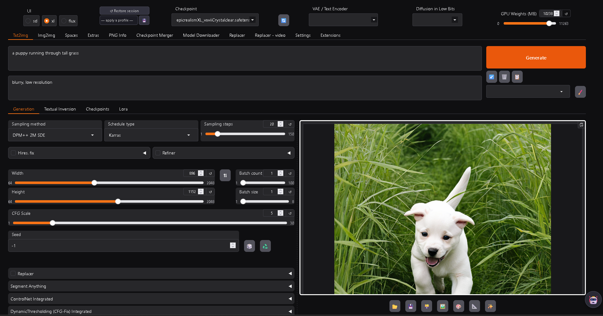
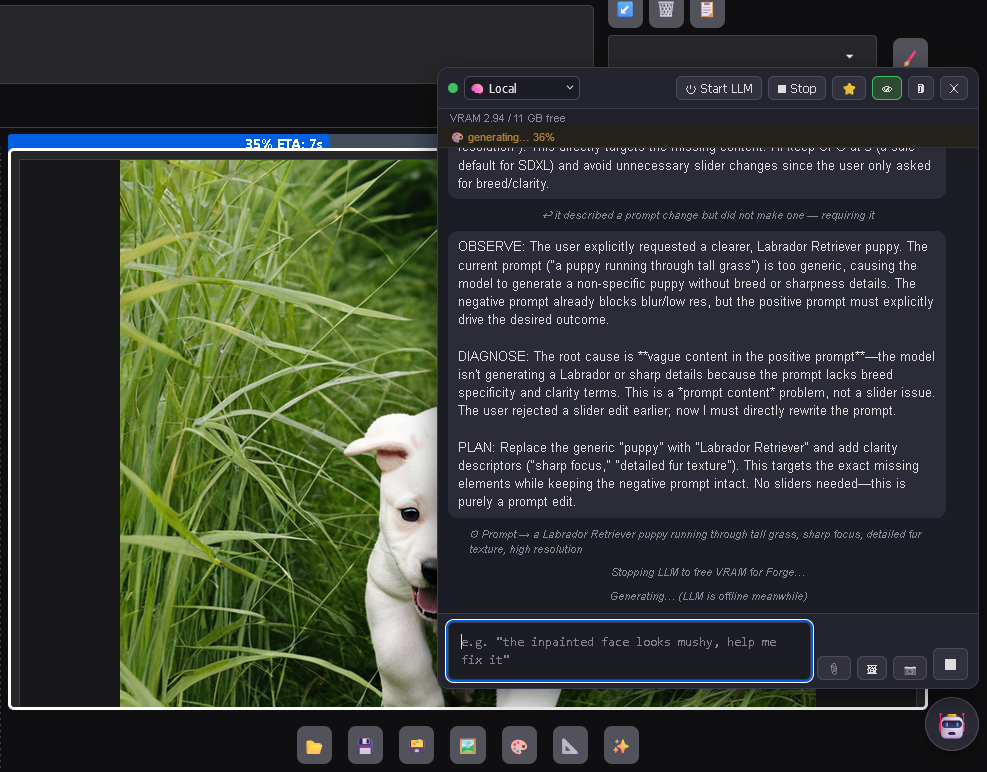
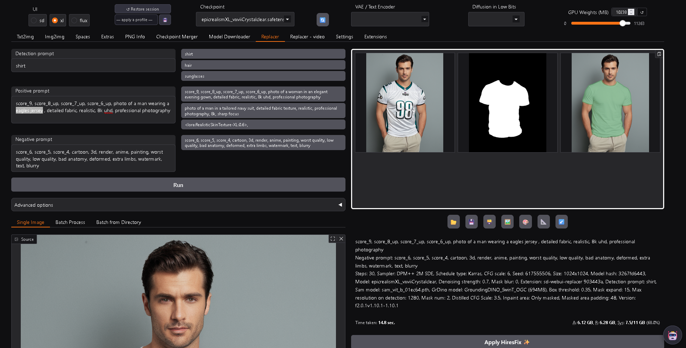

# forge-again

[](https://github.com/logan71f100/forge-again/releases/latest)
[](LICENSE.txt)


A modernized fork of [Stable Diffusion WebUI Forge](https://github.com/lllyasviel/stable-diffusion-webui-forge), ported to the current Python/Gradio/HF ecosystem and packaged to be deployable from a single script.

## Screenshots


*The main UI — the SD / XL / Flux mode switch, the full tab set, and all the generation controls.*


*The AI assistant reads every control, critiques your images, and edits the prompt itself — and hibernates itself to system RAM to hand its VRAM back to Forge for generating, then wakes (~1.5 s) with its context intact to keep helping.*


*Replacer — detection-prompt masking + inpainting in one tab; here, detecting a shirt and swapping it.*

## Features

Everything upstream Forge / A1111 does — txt2img, img2img, inpainting/outpainting, integrated ControlNet, LoRA / Textual Inversion / hypernetworks, hires fix, X/Y/Z plot, prompt attention syntax, styles, the Extras upscalers/face restoration, a full REST API, and the extension ecosystem. See the [A1111 feature showcase](https://github.com/AUTOMATIC1111/stable-diffusion-webui/wiki/Features) for the long list; below is only what this fork changes.

## What's different from upstream Forge

- **Gradio 6** (upstream: 4.40) — the whole UI ported: static-file routes, event semantics, mount-on-demand DOM, component strictness, theming. Includes a compatibility layer (`modules/gradio_extensions.py`) restoring gradio-4 tolerances that extensions rely on.
- **Modern stack**: Python 3.12, torch 2.13 (cu126), transformers 5, numpy 2, Pillow 12, diffusers 0.39.
- **Self-bootstrapping**: `start.bat` downloads a portable Python, builds the venv, installs everything, and launches — a fresh clone needs no system Python and no manual setup. Re-runs are idempotent.
- **Per-mode UI system** (`sd` / `xl` / `flux`): one click switches checkpoint, VAE/text-encoder modules, UI defaults, and prompt presets — **in place, without restarting** the server.
- **Lazy-built tabs** for faster startup and lighter pages.
- **Included extensions** (see credits): Replacer (with a gradio-6 UI rework, per-mode prompt-chip presets editable in Settings, batch modes) and Segment Anything (transformers-5 compatible).
- **AI assistant extension**: a chat panel that can read and drive the whole UI (set any control, run generations, judge results) through a local vision LLM served by [llama.cpp](https://github.com/ggml-org/llama.cpp)'s `llama-server`. **Works out of the box**: a patched `llama-server` build (Windows/CUDA, with the `/sleep` + `/wake` endpoints that let the LLM free its VRAM while Forge generates) is bundled in `forge-llm/`, and the vision model (Qwen3-VL-30B, ~18 GB) **downloads automatically on first launch** to `models/llm/`. Set `FORGE_NO_LLM=1` before launching to skip that download if you don't want the assistant. Everything — provider, model, task guidance, all paths — is configurable under Settings → AI Assistant; you can point it at a different GGUF, your own `llama-server`, or the Claude API instead. On Linux/macOS the bundled binary won't run (it's a Windows CUDA build) — the **source patch and build instructions are in [`forge-llm/patches/`](forge-llm/patches)**, so you can build the same `/sleep`+`/wake` server for your platform (or audit what the bundled binary actually does) and point Settings at it; or skip the assistant entirely.

## Requirements

- **Windows 10/11** (tested — this is the development platform), **Linux x86_64**, or **macOS** (best-effort, untested). Each has its own single self-contained launcher; the bootstrap uses `curl` and `tar`, built into Windows 10+ and standard on Linux/macOS.
- **NVIDIA GPU** on Windows/Linux — dependencies install PyTorch CUDA 12.6 wheels. Developed and tested on an **RTX 2080 Ti (11 GB)**; everything (including flux and the AI assistant's 30B model) runs on 11 GB via offloading and VRAM-hibernate, just slower — more VRAM helps. macOS uses PyTorch's MPS backend (untested).
- Disk: ~12 GB for Python + dependencies, plus your Stable Diffusion checkpoints. The AI assistant downloads its ~18 GB vision model on first launch (skip with `FORGE_NO_LLM=1`); the bundled `llama-server` adds only ~75 MB (its CUDA math libs come from the PyTorch install). Point the assistant at a smaller GGUF in Settings for faster replies on limited VRAM.

## Quick start

Pick your platform — each guide has its own setup steps, caveats and recommendations:

| Platform | Guide | AI assistant | Status |
|---|---|---|---|
| **Windows** | [docs/install-windows.md](docs/install-windows.md) | prebuilt, works out of the box | primary dev/test platform |
| **Docker** (Linux/WSL2 + NVIDIA) | [docs/install-docker.md](docs/install-docker.md) | opt-in, built from source in the image | verified end to end |
| **Linux** (native) | [docs/install-linux.md](docs/install-linux.md) | opt-in, build from the included patch | shares the Windows logic, less tested |
| **macOS** | [docs/install-macos.md](docs/install-macos.md) | build from patch; hibernate untested on Metal | best-effort, untested |

The short version:

```
git clone https://github.com/logan71f100/forge-again
cd forge-again
start.bat            # Windows        (optionally: start.bat sd|xl|flux)
./start.sh           # Linux
./start-macos.sh     # macOS (untested)
docker compose up -d # Docker         (Linux/WSL2 + NVIDIA Container Toolkit)
```

Each **native** launcher is fully self-contained: on first run it downloads a portable Python 3.12, builds the venv, installs PyTorch and all dependencies (several GB), downloads the AI assistant's vision model (~18 GB, unless `FORGE_NO_LLM=1`), then starts the UI listening on `http://0.0.0.0:7860` (`--listen` is default; set `FORGE_PORT` to change the port, `FORGE_MODELS_DIR` to use an external models folder — default is `.\models`, and the LLM lands in `<models>\llm\`). A browser opens automatically (`FORGE_NO_BROWSER=1` to suppress). Re-runs skip completed steps and start in seconds. The **Docker** image works differently — dependencies are baked in at build time, so the container starts in ~30 s with no bootstrap; see [docs/install-docker.md](docs/install-docker.md).

You still supply your own Stable Diffusion checkpoints (see the layout below) — those are not downloaded for you.

Model layout: checkpoints go in `models\checkpoints\sd|xl|flux\` (one folder per mode — the mode switcher scans the matching folder); LoRAs in `models\Lora`, VAEs in `models\VAE`, text encoders in `models\text_encoder`, upscalers in `models\ESRGAN`. Flux mode expects `ae.safetensors` in `models\VAE` and `clip_l.safetensors` + `t5xxl_fp8_e4m3fn.safetensors` in `models\text_encoder`. SAM/GroundingDINO detection models go in `extensions\sd-webui-segment-anything\models\sam` and `...\grounding-dino`.

## Launch arguments

The launchers pass these by default:

| argument | why |
|---|---|
| `--listen` | serve on all interfaces so other machines on your LAN can connect |
| `--port <FORGE_PORT>` | UI port, default 7860 |
| `--api` | enable the `/sdapi/v1/*` REST API (also used by the AI assistant) |
| `--cuda-malloc` | faster CUDA allocator (Windows/Linux only) |
| `--no-half-vae` | avoids black-image VAE overflows |
| `--disable-xformers` | xformers isn't installed; PyTorch attention is used |
| `--skip-python-version-check` | the bundled Python is already the right one |
| `--ckpt-dir / --lora-dir / --vae-dir / --text-encoder-dir / --esrgan-models-path` | point model scanning at the layout above |

To add your own, either put them on a **single line in `extra-args.txt`** next to the launcher (the file is gitignored — create it), or set the **`FORGE_EXTRA_ARGS`** environment variable. Both are appended to every launch, including automatic restarts.

Commonly useful extras (`venv\Scripts\python.exe launch.py --help` lists everything):

| argument | effect |
|---|---|
| `--share` | public gradio.live tunnel URL |
| `--gradio-auth user:pass` | password-protect the UI |
| `--api-auth user:pass` | password-protect the API |
| `--device-id 1` | pick a specific GPU |
| `--theme dark` / `--theme light` | force UI theme |
| `--no-hashing` | skip checkpoint hashing for faster model loads (infotexts lose the model hash) |
| `--loglevel DEBUG` | verbose server logging |

## Credits

### Base projects

- **[lllyasviel / stable-diffusion-webui-forge](https://github.com/lllyasviel/stable-diffusion-webui-forge)** — the Forge backend and UI this fork is directly based on.
- **[AUTOMATIC1111 / stable-diffusion-webui](https://github.com/AUTOMATIC1111/stable-diffusion-webui)** — the original WebUI that Forge itself is built on, along with its many contributors — see [A1111's credits](https://github.com/AUTOMATIC1111/stable-diffusion-webui#credits) for the full lineage.

### Included extensions

Both are included at a pinned upstream commit so their authors can see exactly what was taken; changes on top are limited to compatibility with this fork's newer stack (Gradio 6 / transformers 5). They remain the work of their authors — if you are one of them and would like your component handled differently, please open an issue.

- **[light-and-ray / sd-webui-replacer](https://github.com/light-and-ray/sd-webui-replacer)** — folded at upstream [`aa46106`](https://github.com/light-and-ray/sd-webui-replacer/commit/aa46106) (upstream head at the time), plus a Gradio 6 UI rework and per-mode prompt-chip presets.
- **[continue-revolution / sd-webui-segment-anything](https://github.com/continue-revolution/sd-webui-segment-anything)** — folded at upstream [`982138c`](https://github.com/continue-revolution/sd-webui-segment-anything/commit/982138c) (upstream head at the time), plus transformers 5 compatibility fixes for its bundled GroundingDINO.

### Bundled components (via Forge / A1111)

- **[ControlNet](https://github.com/lllyasviel/ControlNet)** by lllyasviel, and the [sd-webui-controlnet](https://github.com/Mikubill/sd-webui-controlnet) extension by Mikubill that the integrated version derives from.
- **[k-diffusion](https://github.com/crowsonkb/k-diffusion)** by Katherine Crowson — samplers.
- **Stable Diffusion** by [Stability AI](https://stability.ai/) / CompVis / Runway; **SDXL** by Stability AI; **FLUX** by [Black Forest Labs](https://blackforestlabs.ai/).
- **[GFPGAN](https://github.com/TencentARC/GFPGAN)** (Tencent ARC), **[CodeFormer](https://github.com/sczhou/CodeFormer)** (S-Lab), **[Real-ESRGAN](https://github.com/xinntao/Real-ESRGAN)** — face restoration and upscaling.
- The annotator/preprocessor implementations bundled under `extensions-builtin/forge_legacy_preprocessors` (MiDaS, ZoeDepth, OpenPose, OneFormer/detectron2 and others) — each from its original research project.

### Models used by the detection pipeline

- **[Segment Anything (SAM)](https://github.com/facebookresearch/segment-anything)** — Meta AI Research.
- **[GroundingDINO](https://github.com/IDEA-Research/GroundingDINO)** — IDEA-Research.
- **[BLIP](https://github.com/salesforce/BLIP)** — Salesforce, used for interrogation/captioning.
- Upscaler architectures are loaded through **[Spandrel](https://github.com/chaiNNer-org/spandrel)**.

Licenses for borrowed code can be found in the **Settings → Licenses** screen, and in the [`html/licenses.html`](html/licenses.html) file.

## Documentation

General usage is documented in the [A1111 wiki](https://github.com/AUTOMATIC1111/stable-diffusion-webui/wiki) — most of it applies unchanged. Fork-specific internals (the gradio 6 port notes and compatibility layer) are described in [PORTING.md](PORTING.md) and in code comments marked with the gradio version they work around.

## Contributing

Issues and pull requests are welcome. If something renders wrong or crashes, include a screenshot and the console traceback — nearly every gradio-6 issue fixed in this fork was found that way.

## License

AGPL-3.0, inherited from Stable Diffusion WebUI Forge — see [LICENSE.txt](LICENSE.txt). Licenses for bundled third-party code: [`html/licenses.html`](html/licenses.html).
